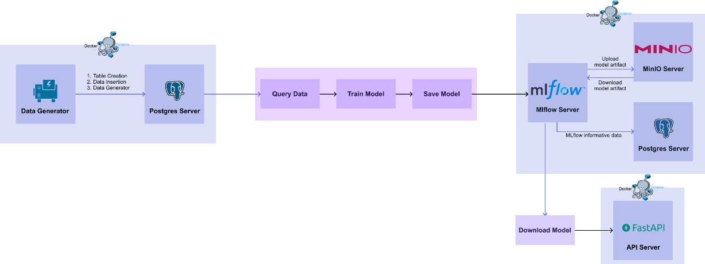
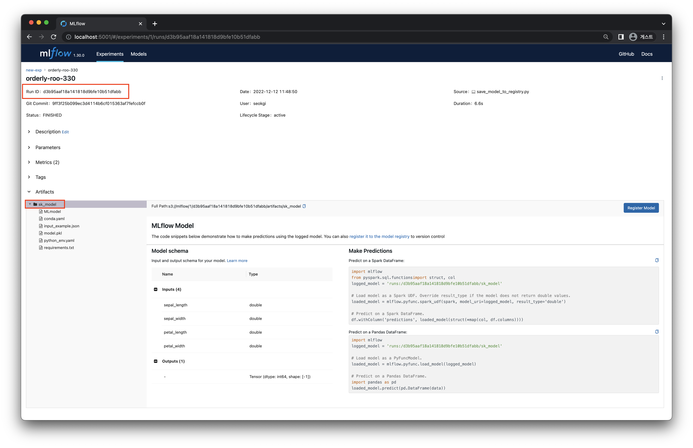
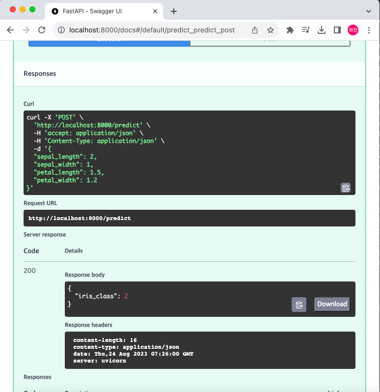

# MLOps for MLE
## Chapter 6 - API Serving

이번 챕터에서는 학습한 모델을 fastapi를 이용해 Request Driven 방식으로 사용하는 방법을 배워볼 것이다.    
📌 01. Database 파트의 DB 와 03. Model Registry 파트의 모델을 이용하기 때문에 01. Database 파트의 DB와 학습된 모델을 불러올 Model Registry 를 띄워놓고 진행해야 한다.    




----------------

# 실습 - 1
## Model API
Iris 데이터를 입력 받고 모델을 통한 예측 값을 반환하는 API를 작성해보겠다. 

### 0. 환경 설정
이번 파트에서 사용할 패키지를 설치한다.
```
pip install boto3==1.26.8 mlflow==1.30.0 "fastapi[all]" pandas scikit-learn
```
또한 fastapi 서버를 실행할 예정이므로 포트가 겹치지 않도록 하기 위해 앞서 실행했던 컨테이너를 종료시키자.
```
docker rm --force api-server
```

### 1. 모델 다운로드 코드 작성
먼저 필요한 패키지들 import 한다.
```python
import os
from argparse import ArgumentParser
import mlflow
```

다음으로 model registry에 저장되어 있는 모델을 다운로드하기 위해 MLflow 서버와 MinIO 서버에 접근해야 한다. 필요한 환경 변수를 설정해준다.
```python
os.environ["MLFLOW_S3_ENDPOINT_URL"] = "http://localhost:9000"
os.environ["MLFLOW_TRACKING_URI"] = "http://localhost:5001"
os.environ["AWS_ACCESS_KEY_ID"] = "minioheejin"
os.environ["AWS_SECRET_ACCESS_KEY"] = "minio6843*"
```
다음으로 mlflow 패키지를 이용해 model artifact를 다운로드한다. 여기서 model artifact란 MLFlow에 모델이 저장될 때 함께 저장된 메타 데이터와 모델 자체의 binary 파일을 이야기한다.
```python
def download_model(args):
    mlflow.artifacts.download_artifacts(artifact_uri=f"runs:/{args.run_id}/{args.model_name}", dst_path=".")
```
이 코드를 실행할 때 다운로드 원하는 모델의 run_id와 model_name을 입력해주어야 하는데 MLFlow 서버에서 확인할 수 있다. 그럼 모델 다운로드 하는 코드를 작성해보겠다. argparse를 이용해 파라미터를 입력받을 수 있도록 하고 download_model() 함수를 호출한다.
```python
if __name__ == "__main__":
    parser = ArgumentParser()
    parser.add_argument("--model-name", dest="model_name", type=str, default="sk_model")
    parser.add_argument("--run-id", dest="run_id", type=str)
    args = parser.parse_args()

    download_model(args)
```

먼저 다운로드받고자 하는 모델의 MLFlow 서버에서 저장된 run_id 와 model_name 을 http://localhost:5001 에 접속하여 확인하자. 모델이 저장된 experiments 와 run 을 선택하여 클릭하고 아래 그림처럼 빨간색 상자 부분에서 run_id 와 model_name 을 각각 확인할 수 있다.

그 다음 아래 명령어를 통해 download_model.py를 실행시켜서 모델일 local에 다운로드하면 된다.
```
python3 download_model.py --model-name sk_model --run_id c175dd75b5d948e48aec04912765efe3
```

실행해보면 sk_model이라는 폴더가 생성되고 그 안에는 다운로드받은 모델과 메타 데이터 등이 들어있을 것이다. 그렇다면 이제 Model API를 작성해보겠다. 

sk_model
├── MLmodel
├── conda.yaml
├── input_example.json
├── model.pkl
├── python_env.yaml
└── requirements.txt


### 2. Model API 명세서 작성
POST /predict 를 수행했을 때 학습한 모델의 inference 결과를 반환해주는 API 명세서를 작성한다. Request Body로 iris 데이터를 전달해주면 Response Body를 통해 예측된 값을 전달받게 된다. 이는 다음과 같다.   
- Request Header: POST /predict   
- Request Body: {"sepal_length": 6.7, "sepal_width": 3.3, "petal_length": 5.7, "petal_width":2.1}   
- Response Body: {"iris_class":2}

### 3. Pydantic Model로 스키마 클래스 작성
schemas.py
```python
from pydantic import BaseModel

# Input Schema
class PredictIn(BaseModel):
    sepal_length: float
    sepal_width: float
    petal_length: float
    petal_width: float
# Output Schema
class PredictOut(BaseModel):
    iris_class: int
```

### 4. Predict API 구현
app.py
```python
import mlflow
import pandas as pd
from fastapi import FastAPI
from schemas import PredictIn, PredictOut


def get_model():
    model = mlflow.sklearn.load_model(model_uri="./sk_model")
    return model


MODEL = get_model()

# Create a FastAPI instance
app = FastAPI()


@app.post("/predict", response_model=PredictOut)
def predict(data: PredictIn) -> PredictOut:
    df = pd.DataFrame([data.dict()])
    pred = MODEL.predict(df).item()
    return PredictOut(iris_class=pred)
```

그럼 작성한 API를 실행해보겠다.
```
uvicorn app:app --reload
```
이제 http://localhost:8000/docs (FastAPI - Swagger UI) 에 접속하여 작동 테스트를 해보자. 

