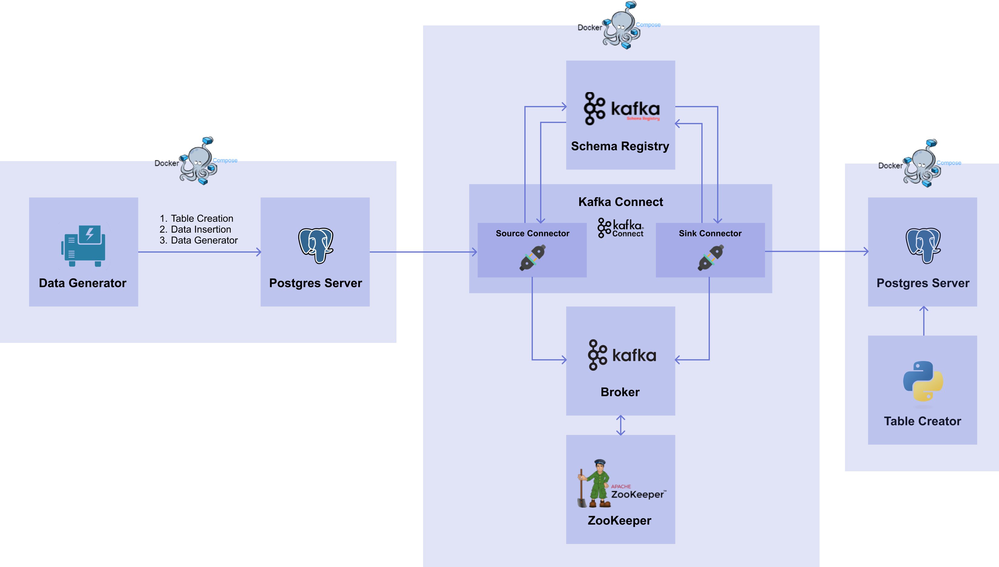

# MLOps for MLE
## Chapter 7 - Kafka

이번 챕터에서는 실시간으로 데이터를 모델에 전달하기 위한 데이터 파이프라인 구축을 해볼 것이다. 실시간으로 생성되는 데이터를 kafka registry로 얻고 kafka connect를 이용해 postgres server (DB 서버)와 연결하여 주고 받을 수 있다.    
여기서 source DB는 데이터가 계속해서 쌓이고 있는 외부 DB, 즉 PostgreSQL DB 서버를 말하며, target DB는 외부에서 가져온 데이터를 처리한 뒤 쌓이는 내부 DB를 말한다.

------------------

# Kafka Introduction
먼저 메시징 시스템에 대해 알아보고 Kafka의 전체 아키텍처를 이해해보자.   

## 메시징 시스템(Message System)

메시징 시스템이란 서로 다른 어플리케이션기리 정보를 교환하기 위해 메세지의 생성, 전송 및 저장을 하는 시스템을 말한다. 주로 하나의 어플리케이션이 여러 외부 어플리케이션에 데이터를 전달하거나 하나 이상의 데이터 소스로부터 데이터를 받아 처리하는 어플리케이션에 사용한다. 여기서 메시지는 하나의 entity에서 다른 하나의 entity로 정보를 전송하는 데 사용되는 통신 아티팩트를 말한다. 메시징 시스템의 대표적인 예로는 Kafka, RabbitMQ, Active MQ, AWS SQS 등이 있다.      

고전적인 분산 컴퓨팅 모델과의 차이점은 무엇일까? 메시징 시스템은 메시지 생산자와 소비자 사이에 약한 결합성을 가지기 때문에 한 쪽이 끊기거나 변경이 있어도 다른 쪽에는 큰 영향을 주지 않는다. 그리고 메시지 생산자와 소비자가 서로를 알지 못한다는 장점도 있다. 덕분에 동적이고 신뢰성있는 유연한 시스템을 구현할 수 있도록 해주며, 하위 어플리케이션의 전체적인 구성 변경도 가능하다는 장점이 있다. 추가로 높은 확장성과 통합성, 안정성의 특징을 가지고 있다. 이 특징 덕분에 서로 다른 네트워크 사이에서 비즈니스와 컴퓨팅 사이언스 문제를 해결하기 위해 많이 사용되며 다양한 어플리케이션의 기반이 되고 있다.   

### 용어 정리
메시징 시스템에서 쓰이는 기본적인 용어들을 정리해보자.

- Message Oriented Middleware / MOM   
  독립된 애플리케이션 간에 데이터를 주고받을 수 있도록 하는 중간 계층에 대한 인프라 아키텍처.   
  비동기(asynchronous)로 메시지를 전달하며 메시지를 발행하는 Publisher, 메시지를 소비하는 Subscriber 로 구성되어 있다.
- Message Broker: 메시지 처리를 하거나 메시지 수신자에게 메시지를 전달하는 시스템
- Message Queue(MQ):Message Broker 와 MOM 을 구현한 소프트웨어 (RabbitMQ, ActiveMQ, Kafka 등)
- Advanced Message Queueing Protocol / AMQP      
  메시지를 안정적으로 주고받기 위한 인터넷 프로토콜로 MOM은 메시지 전송 보장을 해야하므로 AMQP를 구현한다.

뒤이어 살펴볼 Kafka 는 **AMQP 를 구현한 MOM 시스템** 이다.
---------------------------

## Kafka

### 1) Features

### 2) Architecture

### 3) Components