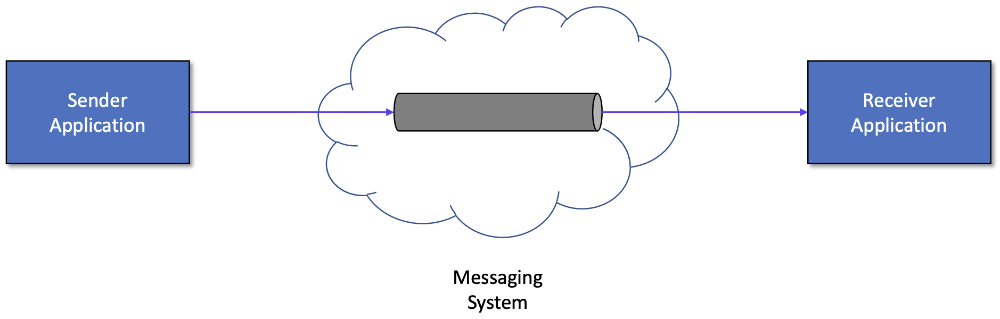
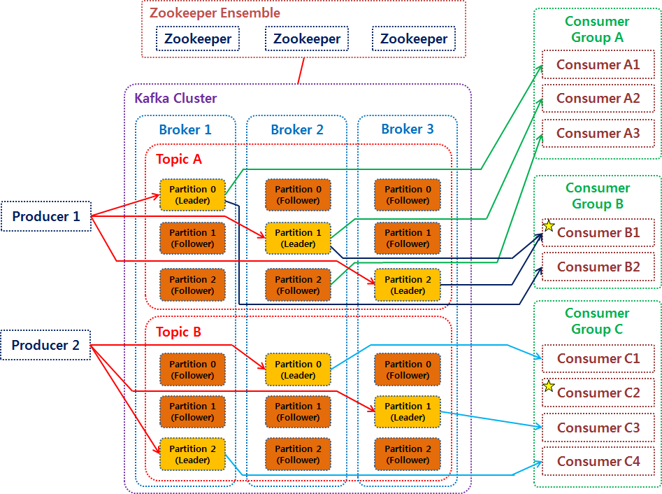
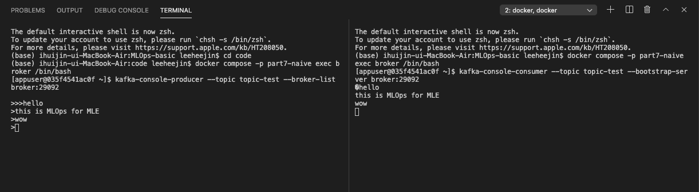

# MLOps for MLE
## Chapter 7 - Kafka

이번 챕터에서는 실시간으로 데이터를 모델에 전달하기 위한 데이터 파이프라인 구축을 해볼 것이다. 실시간으로 생성되는 데이터를 kafka registry로 얻고 kafka connect를 이용해 postgres server (DB 서버)와 연결하여 주고 받을 수 있다.    
여기서 source DB는 데이터가 계속해서 쌓이고 있는 외부 DB, 즉 PostgreSQL DB 서버를 말하며, target DB는 외부에서 가져온 데이터를 처리한 뒤 쌓이는 내부 DB를 말한다.


------------------


# Kafka Introduction
먼저 메시징 시스템에 대해 알아보고 Kafka의 전체 아키텍처를 이해해보자.   

## 메시징 시스템(Message System)

메시징 시스템이란 서로 다른 어플리케이션기리 정보를 교환하기 위해 메세지의 생성, 전송 및 저장을 하는 시스템을 말한다. 주로 하나의 어플리케이션이 여러 외부 어플리케이션에 데이터를 전달하거나 하나 이상의 데이터 소스로부터 데이터를 받아 처리하는 어플리케이션에 사용한다. 여기서 메시지는 하나의 entity에서 다른 하나의 entity로 정보를 전송하는 데 사용되는 통신 아티팩트를 말한다. 메시징 시스템의 대표적인 예로는 Kafka, RabbitMQ, Active MQ, AWS SQS 등이 있다.      

고전적인 분산 컴퓨팅 모델과의 차이점은 무엇일까? 메시징 시스템은 메시지 생산자와 소비자 사이에 약한 결합성을 가지기 때문에 한 쪽이 끊기거나 변경이 있어도 다른 쪽에는 큰 영향을 주지 않는다. 그리고 메시지 생산자와 소비자가 서로를 알지 못한다는 장점도 있다. 덕분에 동적이고 신뢰성있는 유연한 시스템을 구현할 수 있도록 해주며, 하위 어플리케이션의 전체적인 구성 변경도 가능하다는 장점이 있다. 추가로 높은 확장성과 통합성, 안정성의 특징을 가지고 있다. 이 특징 덕분에 서로 다른 네트워크 사이에서 비즈니스와 컴퓨팅 사이언스 문제를 해결하기 위해 많이 사용되며 다양한 어플리케이션의 기반이 되고 있다.   

### 용어 정리
메시징 시스템에서 쓰이는 기본적인 용어들을 정리해보자.

- Message Oriented Middleware / MOM   
  독립된 애플리케이션 간에 데이터를 주고받을 수 있도록 하는 중간 계층에 대한 인프라 아키텍처.   
  비동기(asynchronous)로 메시지를 전달하며 메시지를 발행하는 Publisher, 메시지를 소비하는 Subscriber 로 구성되어 있다.
- Message Broker: 메시지 처리를 하거나 메시지 수신자에게 메시지를 전달하는 시스템
- Message Queue(MQ):Message Broker 와 MOM 을 구현한 소프트웨어 (RabbitMQ, ActiveMQ, Kafka 등)
- Advanced Message Queueing Protocol / AMQP      
  메시지를 안정적으로 주고받기 위한 인터넷 프로토콜로 MOM은 메시지 전송 보장을 해야하므로 AMQP를 구현한다.

뒤이어 살펴볼 Kafka 는 **AMQP 를 구현한 MOM 시스템** 이다.
---------------------------

## Kafka
Kafka는 Open-source Distributed Event Streaming Platform이다. 여기서 Event Streaming이란 데이터베이스, 센서, 모바일 기기, 어플리케이션과 같은 곳에서 발생하는 데이터를 event stream 형태로 저장해서 나중에 검색할 수 있도록 하는 것을 말한다. 다시 말해, 발생하는 데이터를 실시간으로 처리하고, 필요에 따라서 데이터가 또 다른 target 시스템으로 event stream을 라우팅 해주는 것을 말한다.
### 1) Kafka의 주요 특징
- Event Streaming Platform: Event Stream을 실시간으로 처리하고 쌓이는 데이터를 지속적으로 보관하다가 그 데이터를 쓰려고 하는 다른 target 시스템에게 제공한다.
- Publish/Subcribe (Pub/Sub) 구조: 다른 시스템에서 데이터를 가져와서 Kafka에 publish(발행, 저장)하거나 kafka로부터 데이터를 subcribe(구독, 읽기)할 수 있는 기능을 제공한다.  
- Decoupling: Kafka에서는 Pub/Sub 구조를 구현하기 위해 Producer와 Consumer가 존재한다. 두 객체는 서로 의존적이지 않고 완벽하게 분리되어 있다.
  - Producer: Kafka에 event를 publish하는 클라이언트 어플리케이션
  - Consumer: Kafka로부터 event를 subcribe하는 클라이언트 어플리케이션

### 2) Architecture


### 3) Components
* Broker   
  브로커는 메시징 서비스를 담당해주는 kafka 서버나 시스템을 말한다. 하나의 브로커는 하나의 kafka broker process를 의미하며 kafka를 구성한다고 말하거나 kafka를 통해 메시지를 전달한다고 할 때의 Kafka는 브로커를 의미한다고 할 수 있다.   
  프로세스를 구동하는 방법에 따라 다양한 방법으로 클러스터를 구성할 수 있는데, 주로 단일 브로커보다는 다중 브로커를 사용한다. 브로커가 여러 개일 경우에 각각의 브로커들은 ID로 식별된다.   
  브로커의 주요 역할은 Topic 내의 partition들을 분산, 유지 및 관리하는 것이다. 브로커 내부에는 여러 토픽들이 생성될 수 있고, 토픽들에 의해 파티션이 생성된다. 브로커는 파티션의 데이터를 분산하여 저장하기 때문에 시스템이 장애가 생기더라도 분산된 데이터로 안전하게 사용할 수 있게 해준다. 브로커의 중요한 특징 중 하나는 토픽의 일부 파티션들을 포함하고 있지만 데이터의 일부분인 파티션을 가질 뿐 전체 데이터를 갖고 있는 것은 아니라는 점이다.

* Kafka Cluster   
  여러 개의 브로커로 이루어진 집합체를 말한다. 일반적으로 최소 3대 이상의 브로커를 하나의 클러스터로 구성한다.

* Topic   
  토픽이란 브로커에서 event를 관리하는 기준 혹은 어떤 event를 저장할 지에 대한 주제를 말한다. 토픽은 파일 시스템으로 치면 폴더라고, event는 폴더 속의 파일과 같다. 전통적인 메시징 시스템과는 다르게 메시지(event)들을 subcribe해서 받아보더라도 그 메시지는 삭제되지 않는다. 대신 토픽마다 지정된 기간 또는 용량에 따라 event를 유지한다. 

* Partition   
  토픽에는 파티션이 존재하는데 이 파티션들은 Producer로부터 전달된 데이터를 보관하는 역할을 한다. 파티션은 리더 파티션(필수)와 팔로워 파티션으로 구분된다.   
  - 리더 파티션: Producer 혹은 Consumer와 직접 통신하는 파티션이다. read와 write 연산을 담당한다.
  - 팔로워 파티션: 리더 파티션으로 전달된 데이터를 복제하여 저장한다. 리더 파이션에 속해있는 브로커에 장애가 발생하면 팔로워 파티션이 리더 파이션의 지위를 가지고 복사하고 보관하고 있던 데이터를 제공한다.
  - Replication Fator: 리더 파티션과 팔로워 파티션의 개수를 정하는 기준   
    - Replication fator가 1인 경우: 복제가 없으므로 팔로워 파티션이 없다.
    - Replication fator가 3인 경우: 복제를 두개 한다. 브로커 A의 리더 파티션의 데이터를 복제해서 가지고 있을 브로커 B, C의 팔로워 파티션이 존재한다. 브로커 A 의 파티션이 3개였다면, A, B, C 는 각각 하나의 리더 파티션과 두개의 팔로워 파티션을 가지게 된다.

* Zookeeper   
  주키퍼(Zookeeper)란 분산 시스템에서 시스템 간의 정보 유지, 상태 체크, 서버들 간의 동기화 등을 처리해주는 분산 코디네이션 서비스(Distributed Coordination Service)이다. API를 이용하여 동기화를 하거나 마스터 선출 등의 작업을 쉽게 구현할 수 있게 한다. 주키퍼의 데이터는 분산 작업을 제어하기 위해 트리 형태의 데이터 저장소에 스냅샷을 저장한다.
* Zookeeper Ensemble   
  주키퍼 서버의 클러스터로 하나의 주키퍼 서버에 문제가 생겼을 경우, 주키퍼 서버에 쌓이는 데이터로 일관성을 맞추기 때문에 홀수(최소 3개 이상, 5개 권장)로 구축한다. 파티션처럼 하나의 리더 서버가 있고 write를 담당하며 나머지 팔로워 서버는 read를 담당한다. 

* Producer & Consumer    
  * Producer: "메시지를 생산"해서 브로커의 토픽으로 메시지를 보내는 역할을 하는 어플리케이션 또는 서버를 말한다. 데이터를 전송할 때 리더 파티션을 가지고 있는 브로커와 직접 통신하며 이후 어떤 Consumer에게 전송되는 지는 신경쓰지 않는다. 
  * Consumer: 토픽의 파티션에 저장되어 있는 "메시지를 소비"하는 역할을 하는 어플리케이션 또는 서버를 말한다. 데이터를 요청할 때 리더 파티션을 가지고 있는 브로커와 통신하여 토픽의 파티션으로부터 데이터를 가져간다. 운영 방법은 두가지가 있는데 첫번째는 토픽의 특정 파티션만 구도하는 방식, 두번째는 1개 이상의 consumer로 이루어진 consumer 그룹을 운영하는 방식이다. 어떤 Producer 에게서 메시지가 왔는지는 관심이 없고, 원하는 토픽의 파티션을 읽어서 필요한 메시지만 얻어간다. 


--------------------


# 실습 - Producer & Consumer
Docker Compose를 이용하여 주키퍼와 브로커를 생성한다. Producer와 Consumer를 실행하여 메시지를 생성하고 확인하는 작업을 해본다.

## 1. Docker Compose 파일 작성
### Zookeeper
주키퍼는 분산 코디네이션 서비스를 제공하는 오픈소스 프로젝트로 어플리케이션 작업 조율을 쉽게 할 수 있도록 도와준다. 기본적으로 주키퍼 서버들의 집합인 Ensemble로 구성되며 메인 역할은 분산 코디네이션 서비스다. 분산 코디네이션 서비스는 분산 시스템에서 시스템 간의 정보 공유, 상태 체크, 서버들 간 동기화를 위한 락 등을 처리해주는 서비스를 말한다. 이러한 역할을 하기 때문에 동작이 멈추지 않도록 클러스터로 구축하여 안정성을 확보하는 것이다. MLOps에서 분산 시스템을 운영하는 서버는 주키퍼이고 클라이언트는 카프카라고 이해할 수 있다. 

```
version: "3"

services:
  zookeeper:
    image: confluentinc/cp-zookeeper:7.3.0
    container_name: zookeeper
    port:
      - 2181:2181
    environment:
      ZOOKEEPER_SERVER_ID: 1
      ZOOKEEPER_CLIENT_PORT: 2181
```

- image: 주키퍼의 이미지로 confluentinc/cp-zookeeper:7.3.0를 사용한다.
- ZOOKEEPER_SERVER_ID: 주키퍼 클러스터에서 해당 주키퍼를 식별할 id를 지정한다. 여기서는 1을 사용하겠다.
- ZOOKEEPER_CLIENT_PORT: 주키퍼 클라이언트의 포트를 지정한다. 여기서는 기본 주키퍼 포트인 2181을 지정하겠다.

### Broker
브로커 서비스를 띄울 때 쓰이는 요소들을 확인해서 작성해준다.
```
version: "3"
services:
  broker:
    image: confluentinc/cp-kafka:7.3.0
    container_name: broker
    depends_on:
      - zookeeper
    ports:
      - 9092:9092
    environment:
      KAFKA_BROKER_ID: 1
      KAFKA_ZOOKEEPER_CONNECT: zookeeper:2181
      KAFKA_ADVERTISED_LISTENERS: PLAINTEXT://broker:29092,PLAINTEXT_HOST://localhost:9092
      KAFKA_LISTENER_SECURITY_PROTOCOL_MAP: PLAINTEXT:PLAINTEXT,PLAINTEXT_HOST:PLAINTEXT
      KAFKA_INTER_BROKER_LISTENER_NAME: PLAINTEXT
      KAFKA_OFFSETS_TOPIC_REPLICATION_FACTOR: 1
      KAFKA_GROUP_INITIAL_REBALANCE_DELAY_MS: 0
```
- depends_on: 주키퍼가 먼저 실행된 후 다음에 브로커가 실행되어야 한다.
- KAFKA_SERVER_ID: 브로커의 id를 지정한다. 단일 브로커에서는 없어도 무방하나 일단 1로 지정하겠다.
- KAFKA_ZOOKEEPER_CONNECT: 브로커가 주키퍼에 연결하기 위한 주소를 지정한다. 일반적은 형식은 "주키퍼 서비스 이름 : 주키버 서비스 포트"로 작성하며 앞서 띄운 주키퍼의 이름과 포트인 "zookeeper:2181"를 입력한다. 
- KAFKA_ADVERTISED_LISTENERS: 내부와 외부에서 접속하기 위한 리스너를 설정한다. 
- KAFKA_LISTENER_SECURITY_PROTOCOL_MAP: 보안을 위한 protocol mapping을 설정하며 이 설정값은 KAFKA_ADVERTISED_LISTENERS 과 함께 key/value 로 매핑된다.
- KAFKA_INTER_BROKER_LISTENER_NAME: 컨테이너 내부에서 사용할 리스너 이름을 지정한다. 앞서 internal 로 설정했던 PLAINTEXT를 입력해주겠다.
- KAFKA_OFFSETS_TOPIC_REPLICATION_FACTOR: 토픽을 분산하여 저장할 Replication Factor를 설정한다. 여기서는 단일 브로커를 사용하기 때문에 1로 지정하겠다.
- KAFKA_GROUP_INITIAL_REBALANCE_DELAY_MS: 카프카 클러스터가 초기에 rebalancing할 때 consumer들이 조인할 때 대기하는 시간으로 여기서는 0으로 설정해주겠다.

docker compose 파일 작성을 다 했으니 아래 명령어를 활용해 정의된 서비스를 백그라운드 프로세스로 띄우겠다. 
```
docker compose -p part7-naive -f naive-docker-compose.yaml up -d
```

docker ps로 잘 띄워졌는지 확인해본다.
```
CONTAINER ID   IMAGE                             COMMAND                  CREATED          STATUS          PORTS                                        NAMES
035f4541ac0f   confluentinc/cp-kafka:7.3.0       "/etc/confluent/dock…"   25 seconds ago   Up 22 seconds   0.0.0.0:9092->9092/tcp                       broker
e89625eb2f69   confluentinc/cp-zookeeper:7.3.0   "/etc/confluent/dock…"   26 seconds ago   Up 23 seconds   2888/tcp, 0.0.0.0:2181->2181/tcp, 3888/tcp   zookeeper
```


## 2. Producer & Consumer Setup
이번에는 토픽을 생성해보고 producer와 consumer를 생성해보겠다.

### 2.1 topic 생성
```
docker compose -p part7-naive exec broker kafka-topics --create --topic topic-test --bootstrap-server broker:29092 --partitions 1 --replication-factor 1
```
* docker compose exec는 컨테이너 내에 명령어를 수행하도록 한다.
* --create로 토픽을 생성하고, --topic으로 생성할 토픽의 이름을 지정할 수 한다.
* --bootstrap-server는 브로커 서비스에 대한 호스트 이름과 포트를 지정한다. 앞서 docker compose로 띄웠던 브로커의 환경변수를 참고하여 설정한다.
* --partition은 파티션의 개수를 설정하며 --replication-fator은 replication factor을 지정한다.

아래 커멘드를 통해 토픽이 잘 생성되었는지와 상세 설명을 확인할 수 있다.
```
docker compose -p part7-naive exec broker kafka-topics --describe --topic topic-test --bootstrap-server broker:29092
```

### 2.2 Consumer 생성
이제 토픽을 생성했으니 생성한 토픽을 사용한 consumer를 만들어보겠다. consumer를 먼저 실행하는 이유는 일반적으로 consumer가 메시지를 subcribe 하려고 대기하는 상태에서 producer가 메시지를 생성해서 보내기 때문이다.    

먼저 docker compose exec 명령어를 통해 컨테이너 내부로 접속한다. 터미널이 열릴 것이다.
```
docker compose -p part7-naive exec broker /bin/bash
```

이후에 kafka-console-consumer 를 이용하여 topic-test 토픽을 subscribe 한다. 
```
kafka-console-consumer --topic topic-test --bootstrap-server broker:29092
```
그럼 수신을 대기하고 있는 상태가 될 것이다.


### 2.3 Producer 생성
마지막으로 producer를 만들어 메시지를 보낼 준비를 해보겠다. 앞에서 한 것과 같이 새로운 터미널에서 docker compose exec 명령어를 통해 컨테이너 내부로 접속한다. 그 뒤, 아래 커맨드로 topic-test 토픽에 접근해 Publish할 준비를 한다. 그럼 publish 할 수 있는 상태가 될 것이다.

```
kafka-console-producer --topic topic-test --broker-list broker:29092
```


### 2.4 Communicate
producer에서 텍스트를 입력하면 consumer에서 받은 걸 확인할 수 있다.
